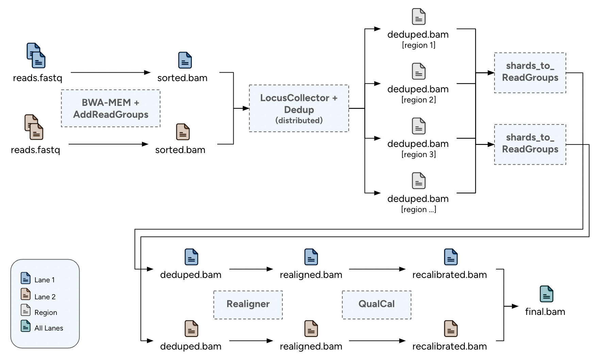

# Short-Read Illumina, *Paired-End*

The paired-end short-read alignment pipeline for Illumina data follows the Genome Analysis Toolkit (GATK) Best Practices. It is designed for per-sample and per-library execution, handling one or multiple sets of paired FASTQ files. The pipeline is optimized for distributed processing, requiring each pair of FASTQ files to correspond to a single sequencing lane.

## Key Pipeline Steps

1. **Alignment with BWA-MEM:** Initial alignment of the raw reads to the reference genome using BWA-MEM.
2. **Read Groups Assignment:** Assignment of reads to specific groups, providing essential information for subsequent steps.
3. **Duplicate Reads Marking:** Identification and labeling of duplicate reads, that originated during library preparation or as sequencing artifacts.
4. **Local Indel Realignment:** Local realignment at identified indel positions.
5. **Base Quality Score Recalibration (BQSR):** Recalibration of base quality scores, including indels, resulting in the generation of a refined, analysis-ready BAM file.

A modified alignment step with BWA-MEM is used for processing Hi-C data.

## Sentieon Software and Distributed Mode

To meet the scalability demands, especially with high-coverage whole-genome sequencing data, the pipeline utilizes a more efficient software implementation from [Sentieon](https://www.sentieon.com/).

Sentieon offers a comprehensive toolkit (DNASeq1) that replicates the original BWA and GATK algorithms, while enhancing computational efficiency. The pipeline also leverage Sentieon’s [distributed mode](https://support.sentieon.com/appnotes/distributed_mode/) to streamline the processing of large data volumes.

The distributed version of the pipeline operates on reads divided by sequencing lanes and parallelizing some of the processing across multiple genomic regions, defined as shards. This implementation is a 1 to 1 equivalent to a standard implementation of the pipeline, producing identical results.

## Pipeline Chart

<b>1</b>: *Kendig KI, Baheti S, Bockol MA, Drucker TM, Hart SN, Heldenbrand JR, Hernaez M, Hudson ME, Kalmbach MT, Klee EW, Mattson NR, Ross CA, Taschuk M, Wieben ED, Wiepert M, Wildman DE, Mainzer LS.* Sentieon DNASeq Variant Calling Workflow Demonstrates Strong Computational Performance and Accuracy. *Front Genet. 2019 Aug 20;10:736.* doi: 10.3389/fgene.2019.00736

---

<!-- This section relies on the html links generated by GitHub Pages 
and will not render correctly in Markdown -->

    <a href="/"> Home </a> -
    <a> <b> Overview </b> </a> -
    <a href="1_Alignment.html"> Alignment </a> -
    <a href="2_Read_Groups.html"> Read Groups </a> -
    <a href="3_Duplicate_Reads.html"> Duplicate Reads </a> -
    <a href="4_Local_Realignment.html"> Local Realignment </a> -
    <a href="5_Base_Quality_Score_Recalibration.html"> Base Quality Score Recalibration </a> -
    <a href="6_Hi-C.html"> Hi-C </a>

