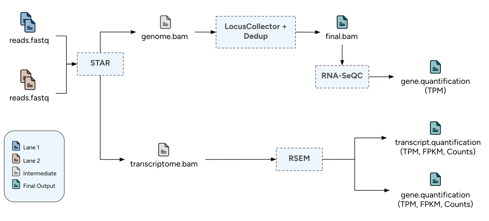

# Short-Read RNA-seq, *Paired-End*

The paired-end short-read analysis pipeline for RNA-seq data is based on GTEx1 and TOPMed2 analysis pipelines. It is designed for per-sample execution, handling one or multiple sets of paired FASTQ files.

## Key Pipeline Steps

1. **Alignment with STAR:** Initial alignment of the raw reads to the reference genome and the transcriptome using STAR.
2. **Duplicate Reads Marking:** Identification and labeling of duplicate reads, that originated during library preparation or as sequencing artifacts.
3. **Transcript Quantification:** Transcript-level quantification using RSEM.
4. **Gene Quantification:** Gene-level quantification using RNA-SeQC.

## Sentieon Software

To meet the scalability demands, the pipeline utilizes a more efficient software implementation from [Sentieon](https://www.sentieon.com/). Sentieon offers a comprehensive toolkit that replicates the original STAR and GATK algorithms, while enhancing computational efficiency.

## Pipeline Chart

<b>1</b>: *Lonsdale, J., Thomas, J., Salvatore, M. et al.* The Genotype-Tissue Expression (GTEx) project. *Nat Genet 45, 580–585 (2013).* doi: 10.1038/ng.2653; <b>2</b>: *Taliun, D., Harris, D.N., Kessler, M.D. et al.* Sequencing of 53,831 diverse genomes from the NHLBI TOPMed Program. *Nature 590, 290–299 (2021).* doi: 10.1038/s41586-021-03205-y

---

<!-- This section relies on the html links generated by GitHub Pages 
and will not render correctly in Markdown -->

    <a href="/pipelines-docs_testing/"> Home </a> -
    <a> <b> Overview </b> </a> -
    <a href="1_Alignment.html"> Alignment </a> -
    <a href="2_Duplicate_Reads.html"> Duplicate Reads </a> -
    <a href="3_Transcript_Quantification.html"> Transcripts </a> -
    <a href="4_Gene_Quantification.html"> Genes </a>

